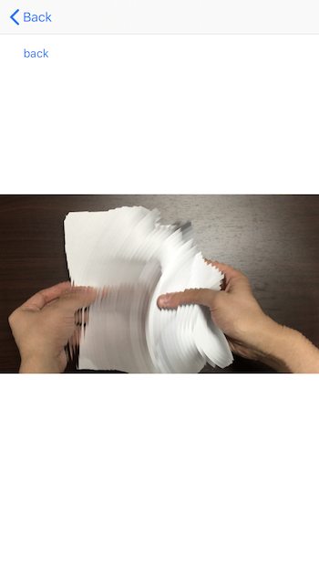

# 3D Touch Slit Scan

This is a experimental project using 3D touch feature of iPhone.

Slit-scanning video images controlled by 3d touch.

Please see these videos to see the behavior.

- [3D touch experiment #1](https://www.youtube.com/watch?v=VpdZ49zY4yA)
- [3D touch experiment #2](https://www.youtube.com/watch?v=rliPUZSN6_o&t=24s)
- [3D touch experiment #3](https://www.youtube.com/watch?v=4C-AtnNLedQ)

## Usage
- select picture
- deep press the picture

## Reference

- [An Informal Catalogue of Slit-Scan Video Artworks and Research](http://www.flong.com/texts/lists/slit_scan/)
- [The Khronos Projector](http://www.k2.t.u-tokyo.ac.jp/perception/KhronosProjector/index-e.html)
